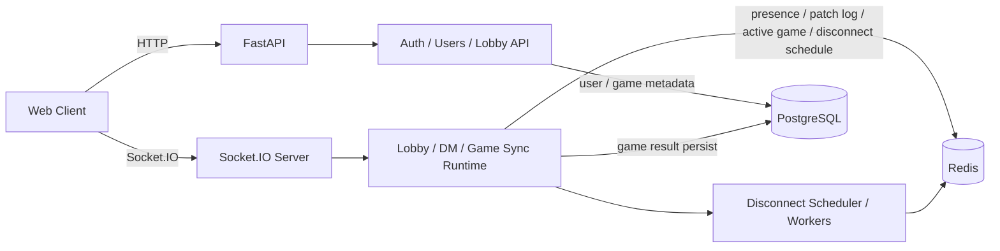

# 모두의 마블 Backend

> 카카오 로그인, 로비, 실시간 턴 처리, 재연결 복구까지 책임지는 웹 멀티플레이 보드게임 서버

## 프로젝트 소개

**모두의 마블 Backend**는 여러 플레이어가 웹에서 함께 즐기는 보드게임 경험을 안정적으로 제공하기 위한 서버입니다.

카카오 로그인 또는 게스트 로그인으로 빠르게 입장하고, 방을 만들어 친구들과 실시간으로 게임을 시작할 수 있습니다. 주사위, 이동, 통행료, 건설, 턴 진행 같은 핵심 판정을 서버가 처리하며, 연결이 잠시 끊겨도 현재 상태를 다시 맞춰 이어서 플레이할 수 있습니다.

단순 CRUD 서버가 아니라 **로그인부터 로비, 실시간 턴 처리, 상태 동기화, 재연결 복구, 결과 저장까지 게임 플레이 흐름 전체를 책임지는 게임 서버**입니다.

---

## 아키텍처



- 자주 바뀌는 게임 상태는 **Redis**, 결과 및 전적은 **PostgreSQL**에 저장합니다.
- 클라이언트는 행동 의도만 보내고, 실제 판정은 서버가 결정합니다. (**server authoritative**)
- 연결이 끊긴 플레이어는 즉시 탈락 처리하지 않고 **disconnect grace** 유예 시간 후 worker가 처리합니다.
- revision 기반 patch 또는 snapshot으로 재연결 시 상태를 다시 맞춥니다.

---

## 기술 스택

| 분류 | 기술 |
|------|------|
| Core | Python 3.11+, FastAPI, python-socketio, Uvicorn |
| Data & State | PostgreSQL, Redis, Tortoise ORM, Aerich |
| Ops & Quality | Docker / Docker Compose, uv, Pytest, Ruff, structlog |
| External | Kakao OAuth |

---

## 프로젝트 구조

```text
.
├─ app/
│  ├─ dm/                  # DM 소켓 핸들러
│  ├─ game/                # 게임 도메인, 상태, 타이머, 동기화, 소켓 핸들러
│  ├─ lobby/               # 로비 / 대기방 소켓 핸들러
│  ├─ models/              # Tortoise ORM 모델
│  ├─ routers/             # FastAPI 라우터
│  ├─ schemas/             # 요청 / 응답 스키마
│  ├─ services/            # 비즈니스 로직
│  ├─ utils/               # JWT, 공통 유틸, 예외 처리
│  ├─ config.py
│  ├─ errors.py
│  ├─ main.py
│  ├─ presence.py
│  └─ redis_client.py
├─ migrations/             # Aerich 마이그레이션
├─ tests/
├─ Dockerfile
├─ docker-compose.yml
├─ Makefile
└─ pyproject.toml
```

---

## 빠르게 실행하기

### 1. 저장소 클론

```bash
git clone https://github.com/modoo-marble-team/modoo-marble-backend.git
cd modoo-marble-backend
```

### 2. 환경 변수 설정

```bash
cp .env.example .env
```

#### 주요 환경 변수

| 변수 | 필수 | 기본값 | 설명 |
|------|------|--------|------|
| `DATABASE_URL` | 아니오 | `postgres://modoo:modoo1234@db:5432/modoo_marble` | PostgreSQL 연결 문자열 |
| `REDIS_URL` | 아니오 | `redis://redis:6379` | Redis 연결 문자열 |
| `JWT_SECRET` | **운영: 예** | 개발 환경 자동 설정 | 운영에서는 강한 랜덤 값 사용 |
| `JWT_ALGORITHM` | 아니오 | `HS256` | |
| `JWT_ACCESS_EXPIRE_MINUTES` | 아니오 | `60` | |
| `JWT_REFRESH_EXPIRE_DAYS` | 아니오 | `14` | |
| `KAKAO_CLIENT_ID` | 선택 | - | 카카오 로그인 사용 시 |
| `KAKAO_CLIENT_SECRET` | 선택 | - | 카카오 로그인 사용 시 |
| `KAKAO_REDIRECT_URI` | 선택 | - | 카카오 로그인 콜백 URI |
| `FRONTEND_LOGIN_REDIRECT` | 선택 | - | 로그인 완료 후 프론트 리다이렉트 주소 |
| `CORS_ORIGINS` | 아니오 | `["http://localhost:3000","http://localhost:5173"]` | 허용할 프론트 Origin |
| `REFRESH_COOKIE_SAMESITE` | 아니오 | `none` | 로컬 HTTP 개발에서는 `lax` 권장 |
| `DB_USER` / `DB_PASSWORD` / `DB_NAME` | Docker 사용 시 예 | - | PostgreSQL 컨테이너 초기 설정 |

> 게스트 로그인만 확인할 경우 `KAKAO_*` 변수는 비워도 됩니다.

### 3. 실행

**Docker Compose**

```bash
docker compose up --build
```

**로컬 실행** (PostgreSQL, Redis가 먼저 실행 중이어야 합니다)

```bash
uv sync
uv run uvicorn app.main:application --reload --host 0.0.0.0 --port 8000
```

### 4. 확인

| 경로 | 설명 |
|------|------|
| `http://localhost:8000` | API 서버 |
| `http://localhost:8000/docs` | Swagger UI |
| `http://localhost:8000/redoc` | ReDoc |
| `http://localhost:8000/health` | Health Check |

---

## 운영 배포 체크리스트

- `JWT_SECRET`을 예측 불가능한 강한 값으로 교체
- `CORS_ORIGINS`를 실제 프론트 도메인만 허용
- HTTPS 환경에서 `REFRESH_COOKIE_SECURE=true`, `REFRESH_COOKIE_SAMESITE=none` 설정
- 카카오 OAuth 사용 시 `KAKAO_REDIRECT_URI`, `FRONTEND_LOGIN_REDIRECT`를 배포 주소와 일치시킬 것
- 리버스 프록시 사용 시 WebSocket Upgrade 헤더 전달 필수

```nginx
proxy_http_version 1.1;
proxy_set_header Upgrade $http_upgrade;
proxy_set_header Connection "upgrade";
```

---

## 자주 쓰는 명령어

| 명령어 | 설명 |
|--------|------|
| `make fmt` | 포맷 + import 정리 |
| `make lint` | 린트 (수정 없음) |
| `make test` | 테스트 실행 |
| `make check` | fmt + lint + test 한번에 |
| `make build` | Docker 이미지 빌드 |
| `make up` | 컨테이너 실행 (백그라운드) |
| `make down` | 컨테이너 종료 |
| `make restart` | 컨테이너 재시작 |
| `make logs` | 로그 tail |
| `make ps` | 실행 중 컨테이너 목록 |
| `make sync` | develop 브랜치 최신화 |

---

## 문서

- **Docs Repo**: [modoo-marble-team/docs](https://github.com/modoo-marble-team/docs)
  - [API / WebSocket 인덱스](https://github.com/modoo-marble-team/docs/blob/main/api.md)
  - [로비 / 대기방 / 프레즌스 명세](https://github.com/modoo-marble-team/docs/blob/main/lobby.md)
  - [DM 명세](https://github.com/modoo-marble-team/docs/blob/main/dm.md)
  - [게임 소켓 명세](https://github.com/modoo-marble-team/docs/blob/main/gamesocket.md)
  - [ERD](https://github.com/modoo-marble-team/docs/blob/main/erd.md)
